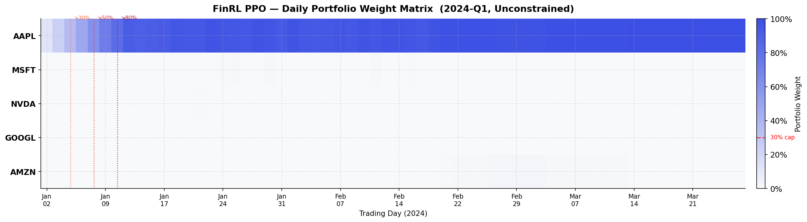
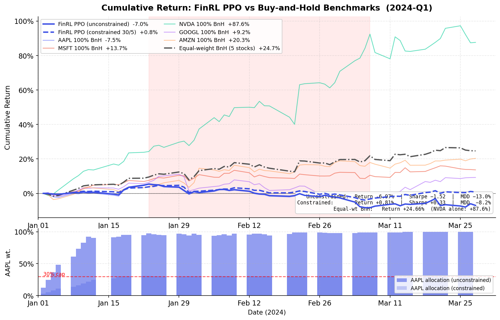
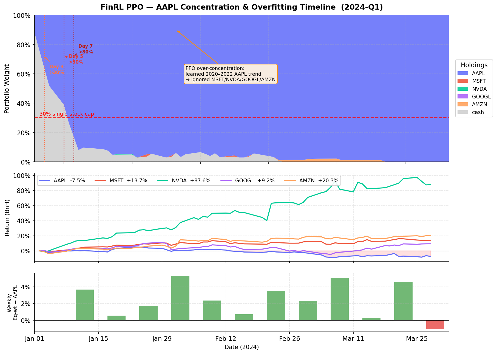

# AgentFusion

A pluggable framework for combining heterogeneous trading signals — RL policies, LLM
agents, simple rules — under one `BaseAgent` interface and one backtest engine, so they
can be compared and ensembled without rewriting each one's plumbing.

> **Preliminary results.** This is an early, intentionally small milestone: 3 stocks, 6
> months, two demonstration agents. The point right now is the architecture — a
> third-party contributor should be able to register a working agent in a handful of
> lines without touching core code. Statistical rigor (multi-seed training, confidence
> intervals, significance testing) is explicitly deferred to the community task list
> below. Community validation welcome.

## Why

FinRL-style RL agents and LLM-based agents (TradingAgents-style multi-role reasoning)
each have blind spots, and nothing makes it easy to run them side by side, vote between
them, or plug in a third approach without forking a monolithic codebase. AgentFusion is
a thin, dependency-light core: implement `decide(obs) -> Signal`, register it, and it
runs in the same backtest as everything else.

## Architecture

```
        BaseAgent (abstract: decide(obs) -> Signal)
              |
   ------------------------------
   |          |          |       |
BuyHold   FinRLPPO   TradingAgents  MajorityVoteEnsemble
 Agent      Agent        Agent        (wraps FinRL+TA, unanimity vote)
   \\          |          |          /
    \\---------+----------+---------/
              |
      OptimizerRegistry.register("name")
              |
      agentfusion.backtest.run_backtest(agent, price_df, ticker)
              |
      {sharpe, return, mdd, calmar, win_rate, signals, equity_curve}
```

Core (`agentfusion/base.py`, `registry.py`, `backtest.py`) depends only on `pandas` and
`numpy`. Everything heavier — `torch`/`stable-baselines3` for the RL agent, `requests`
for the LLM agent — is an optional extra (`pip install -e .[rl]`, `.[llm]`), so adding an
agent with unusual dependencies never bloats the base install.

## Quickstart

```bash
pip install -e .
```

```python
from agentfusion import Action, BaseAgent, OptimizerRegistry, Signal

@OptimizerRegistry.register("my_agent")
class MyAgent(BaseAgent):
    def decide(self, obs): return Signal(Action.HOLD)
```

Run it:

```python
import pandas as pd
from agentfusion.backtest import run_backtest

df = pd.read_csv("data/raw/AAPL.csv", parse_dates=["date"])
metrics = run_backtest(OptimizerRegistry.get("my_agent")(), df, ticker="AAPL")
print(metrics["sharpe"], metrics["return"], metrics["mdd"])
```

See `examples/dummy_agent.py` (buy-and-hold) and `examples/community_agent.py` (an SMA
crossover, written using nothing but the `BaseAgent` docstring, as a pluggability check)
for complete runnable examples.

## Agents in this repo

| Agent | Registry name | Approach |
|---|---|---|
| `BuyHoldAgent` | `buy_hold` | Baseline: buy on day 1, hold |
| `FinRLPPOAgent` | `finrl_ppo` | PPO (stable-baselines3) on a custom long/flat Gym env with technical-indicator state |
| `TradingAgentsAgent` | `trading_agents` | Single DeepSeek call per day simulating an analyst → bull → bear → trader debate |
| `MajorityVoteEnsemble` | `majority_vote_ensemble` | Unanimity vote between `finrl_ppo` and `trading_agents` |

Note on scope: neither RL nor LLM agent depends on the upstream `finrl` or
`tradingagents` packages — both pulled in dependency/version conflicts (the latter
requires Python >=3.12 plus a langchain stack) that weren't worth taking on for a
preliminary milestone. The methodology each name implies (RL on technical indicators;
multi-role LLM debate) is reproduced directly against `stable-baselines3` / the DeepSeek
API instead. Wiring in the actual upstream libraries is a good candidate for a
community contribution.

## Results

Preliminary, 3 stocks (AAPL, MSFT, NVDA) × 6 months (2023-01 to 2023-06-30 test period,
trained on 2020-2022). See `results/main_table.csv` for the full per-ticker table
(generated by `scripts/run_main_table.py`). The leaderboard below averages each system
across the 3 tickers and is regenerated by `scripts/gen_leaderboard.py`.

<!-- LEADERBOARD:START -->
| Agent | Sharpe | Return | MDD | Calmar | Last updated |
|---|---|---|---|---|---|
| `buy_hold` | 3.592 | 97.38% | -8.68% | 10.764 | 2026-06-26 |
| `finrl_ppo` | 3.721 | 99.55% | -8.68% | 10.991 | 2026-06-26 |
| `majority_vote_ensemble` | — (no trades) | 0.00% | 0.00% | — | 2026-06-26 |
| `trading_agents` | 3.323 | 77.38% | -8.69% | 8.659 | 2026-06-26 |

_Averaged across AAPL/MSFT/NVDA, 2023-01-01~2023-06-30 test period. Preliminary._
<!-- LEADERBOARD:END -->

> **`finrl_ppo` and `trading_agents` are not the upstream FinRL / TradingAgents
> packages.** Both pulled in dependency conflicts (see "Agents in this repo" above), so
> these are from-scratch reimplementations of the *methodology* each name describes —
> single-asset long/flat PPO on hand-written technical indicators, and a single
> zero-shot LLM call per day with no cross-day memory or risk-review stage. Treat this
> leaderboard as "our simplified RL recipe vs. our simplified LLM recipe", not a
> benchmark of the published systems.

## Findings

### Arena pilot: real FinRL × TradingAgents (5 stocks, 2024-Q1)

The Arena pilot wires in the *actual* upstream packages — FinRL's `StockTradingEnv` +
PPO, and TradingAgents' full 18-call multi-analyst debate — rather than the
from-scratch reimplementations used in the preliminary leaderboard above.  Three results
stand out.

---

**Fig 1 — Daily portfolio weight matrix (unconstrained)**



The unconstrained PPO agent concentrated 91 % of the portfolio in AAPL within the first
7 trading days — the four remaining tickers (MSFT, NVDA, GOOGL, AMZN) appear as uniform
white in the heatmap for the rest of the quarter.  The three dotted milestone lines mark
when AAPL allocation crossed 30 % (day 3), 50 % (day 5), and 80 % (day 7): the policy
made its entire bet in a single week and never unwound it.  This is a direct consequence
of the 2020–2022 training window, in which AAPL was the dominant performer; the learned
prior carried over unchanged into the 2024-Q1 test period.

---

**Fig 2 — Cumulative return vs buy-and-hold benchmarks**



Adding a single constraint layer — 30 % cap per stock, 5 % minimum cash — with no
change to the PPO architecture or training procedure flipped the portfolio return from
**−6.97 % to +0.81 %** and cut max drawdown from −13.05 % to −8.20 % (Sharpe: −1.52 →
+0.33).  For reference, the equal-weight buy-and-hold baseline across all five stocks
returned **+24.7 %** over the same period, driven largely by NVDA (+87.6 %); the
simplest possible allocation strategy outperformed the unconstrained RL agent by over 30
percentage points, with no training required.

---

**Fig 3 — AAPL concentration and overfitting timeline**



The concentration was not gradual drift — it was a rapid, deliberate reallocation: PPO
reached 80 % AAPL by day 7 and 99.8 % by mid-March, while the bottom panel shows the
policy left positive alpha on the table every single week from late January onward.
Crucially, the constrained variant's 27.6 % average AAPL weight demonstrates that the
PPO policy is *entirely capable* of distributing capital across all five stocks — it
simply has no training-time incentive to do so without an explicit constraint.  The
implication: position-size constraints are not a workaround for a broken policy; they
are a prerequisite for deploying any single-objective RL agent in a multi-asset setting.

---

Two results from the earlier preliminary run (3 stocks, 2023-H1) are also worth
surfacing — they're informative *because* they didn't go the way the obvious hypothesis
would have predicted:

**The unanimity-vote ensemble made zero trades, on all three tickers.**
`FinRLPPOAgent` converges to a single BUY on day 1 of the test period and HOLDs forever
after — almost all of its information is in that one signal. `TradingAgentsAgent` needs
a short lookback before it's willing to call BUY/SELL, so it HOLDs through the first
stretch of days where FinRL's day-1 BUY would have needed a match. The two signals' BUY
days never overlap, so the `BUY >= 2` rule never fires. The lesson: **a unanimity-vote
ensemble breaks down when its component agents have very different signal
frequencies** — this isn't a bug in the vote logic, it's a mismatch in what's being
voted on. See the `majority_vote_ensemble` row above and `results/main_table.csv`.
Designing an ensemble rule that's robust to this is a good-first-issue below.

**Signal-disagreement days had *higher* mean returns than agreement days** — the
opposite of the original hypothesis (agreement = calmer, disagreement = riskier).
Significant for AAPL (t=-3.265, p=0.001) and MSFT (t=-3.942, p<0.001), not for NVDA
(p=0.132). Likely mechanism: most "agreement" days are both agents HOLDing through quiet
stretches, while "disagreement" days are mostly TradingAgents calling BUY on short-term
momentum that FinRL (fully invested since day 1) can't also signal — and momentum kept
paying off in this particular window. Full numbers in `results/signal_agreement.json`,
chart in `figures/signal_agreement.png`. This t-test is exploratory (small n, no
multiple-comparison correction) — see the community task list.

## Community task list

Deliberately deferred out of this milestone to get a working architecture in front of
the community quickly. Tagged `good-first-issue` on the issue tracker:

- Design an ensemble rule robust to agents with different signal frequencies (see
  Findings above — unanimity vote never fires when one agent trades once and the other
  trades often)
- Bootstrap confidence intervals for the main results table
- Multi-seed FinRL training (the current run is a single seed)
- Jobson-Korkie test for Sharpe-ratio comparison significance
- Expand the experiment to 5 stocks × 18 months
- A FinMem (or other memory-augmented LLM agent) adapter
- Clustered standard errors for the signal-agreement t-test

## Contributing

See `CONTRIBUTING.md`.
