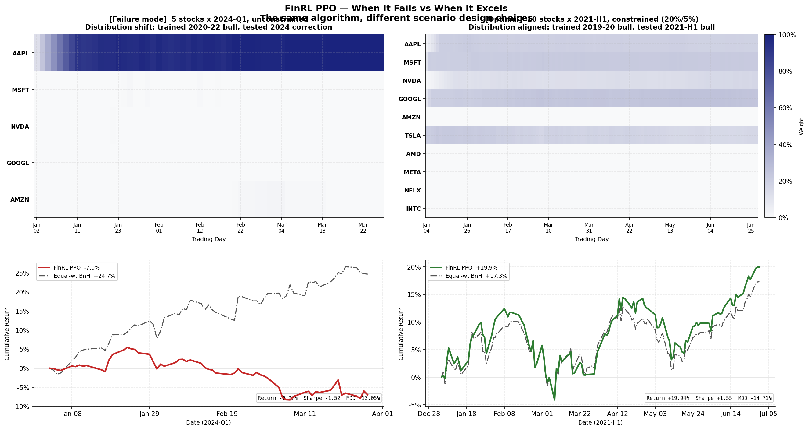
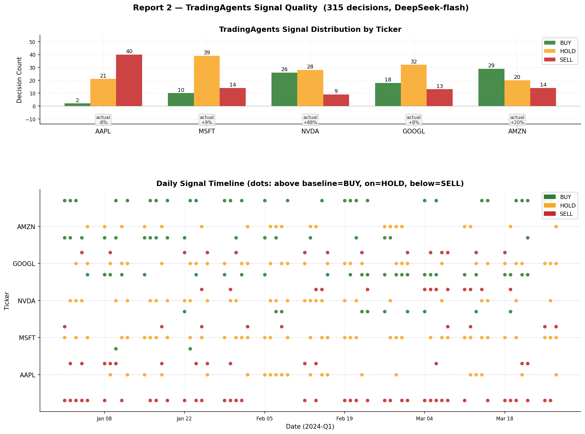
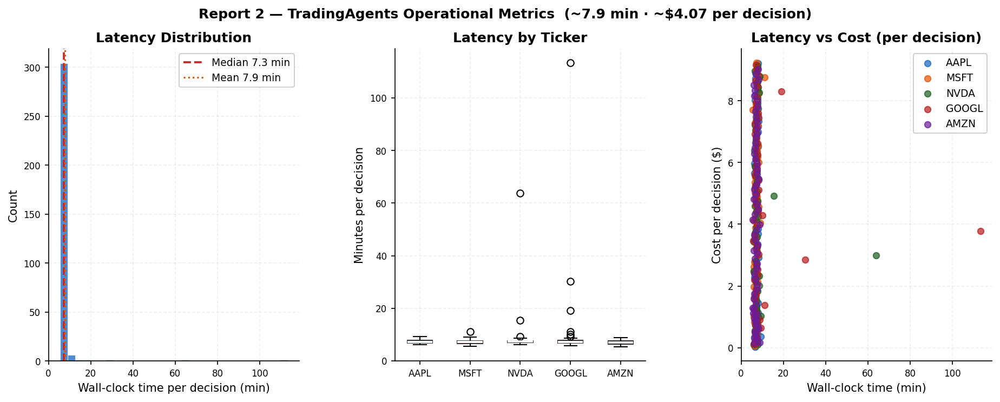
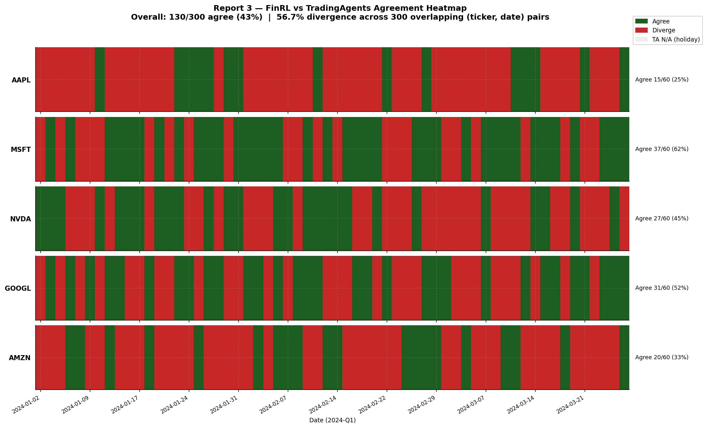
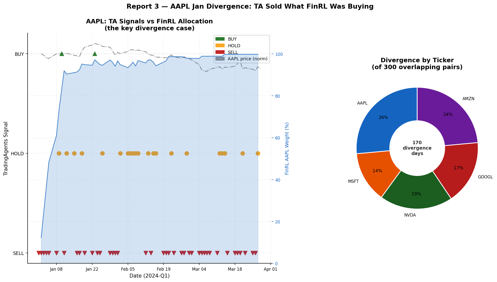
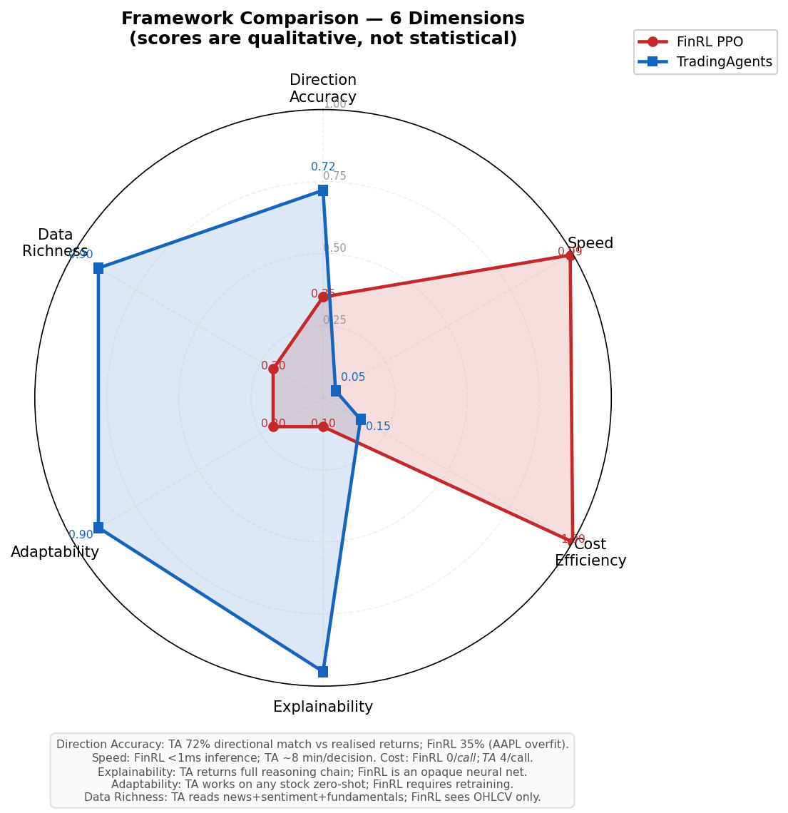

# AgentFusion

A pluggable framework for combining heterogeneous trading signals — RL policies, LLM
agents, simple rules — under one `BaseAgent` interface and one backtest engine, so they
can be compared and ensembled without rewriting each one's plumbing.

> **Preliminary results.** This is an early, intentionally small milestone: 3 stocks, 6
> months, two demonstration agents. The point right now is the architecture — a
> third-party contributor should be able to register a working agent in a handful of
> lines without touching core code. Statistical rigor (multi-seed training, confidence
> intervals, significance testing) is explicitly deferred to the community task list
> below. Community validation welcome.

## Why

FinRL-style RL agents and LLM-based agents (TradingAgents-style multi-role reasoning)
each have blind spots, and nothing makes it easy to run them side by side, vote between
them, or plug in a third approach without forking a monolithic codebase. AgentFusion is
a thin, dependency-light core: implement `decide(obs) -> Signal`, register it, and it
runs in the same backtest as everything else.

## Architecture

```
        BaseAgent (abstract: decide(obs) -> Signal)
              |
   ------------------------------
   |          |          |       |
BuyHold   FinRLPPO   TradingAgents  MajorityVoteEnsemble
 Agent      Agent        Agent        (wraps FinRL+TA, unanimity vote)
   \\          |          |          /
    \\---------+----------+---------/
              |
      OptimizerRegistry.register("name")
              |
      agentfusion.backtest.run_backtest(agent, price_df, ticker)
              |
      {sharpe, return, mdd, calmar, win_rate, signals, equity_curve}
```

Core (`agentfusion/base.py`, `registry.py`, `backtest.py`) depends only on `pandas` and
`numpy`. Everything heavier — `torch`/`stable-baselines3` for the RL agent, `requests`
for the LLM agent — is an optional extra (`pip install -e .[rl]`, `.[llm]`), so adding an
agent with unusual dependencies never bloats the base install.

## Quickstart

```bash
pip install -e .
```

```python
from agentfusion import Action, BaseAgent, OptimizerRegistry, Signal

@OptimizerRegistry.register("my_agent")
class MyAgent(BaseAgent):
    def decide(self, obs): return Signal(Action.HOLD)
```

Run it:

```python
import pandas as pd
from agentfusion.backtest import run_backtest

df = pd.read_csv("data/raw/AAPL.csv", parse_dates=["date"])
metrics = run_backtest(OptimizerRegistry.get("my_agent")(), df, ticker="AAPL")
print(metrics["sharpe"], metrics["return"], metrics["mdd"])
```

See `examples/dummy_agent.py` (buy-and-hold) and `examples/community_agent.py` (an SMA
crossover, written using nothing but the `BaseAgent` docstring, as a pluggability check)
for complete runnable examples.

## Agents in this repo

| Agent | Registry name | Approach |
|---|---|---|
| `BuyHoldAgent` | `buy_hold` | Baseline: buy on day 1, hold |
| `FinRLPPOAgent` | `finrl_ppo` | PPO (stable-baselines3) on a custom long/flat Gym env with technical-indicator state |
| `TradingAgentsAgent` | `trading_agents` | Single DeepSeek call per day simulating an analyst → bull → bear → trader debate |
| `MajorityVoteEnsemble` | `majority_vote_ensemble` | Unanimity vote between `finrl_ppo` and `trading_agents` |

Note on scope: neither RL nor LLM agent depends on the upstream `finrl` or
`tradingagents` packages — both pulled in dependency/version conflicts (the latter
requires Python >=3.12 plus a langchain stack) that weren't worth taking on for a
preliminary milestone. The methodology each name implies (RL on technical indicators;
multi-role LLM debate) is reproduced directly against `stable-baselines3` / the DeepSeek
API instead. Wiring in the actual upstream libraries is a good candidate for a
community contribution.

## Results

Preliminary, 3 stocks (AAPL, MSFT, NVDA) × 6 months (2023-01 to 2023-06-30 test period,
trained on 2020-2022). See `results/main_table.csv` for the full per-ticker table
(generated by `scripts/run_main_table.py`). The leaderboard below averages each system
across the 3 tickers and is regenerated by `scripts/gen_leaderboard.py`.

<!-- LEADERBOARD:START -->
| Agent | Sharpe | Return | MDD | Calmar | Last updated |
|---|---|---|---|---|---|
| `buy_hold` | 3.592 | 97.38% | -8.68% | 10.764 | 2026-06-29 |
| `finrl_ppo` | 3.721 | 99.55% | -8.68% | 10.991 | 2026-06-29 |
| `majority_vote_ensemble` | — (no trades) | 0.00% | 0.00% | — | 2026-06-29 |
| `trading_agents` | 3.323 | 77.38% | -8.69% | 8.659 | 2026-06-29 |

_Averaged across AAPL/MSFT/NVDA, 2023-01-01~2023-06-30 test period. Preliminary._
<!-- LEADERBOARD:END -->

> **`finrl_ppo` and `trading_agents` are not the upstream FinRL / TradingAgents
> packages.** Both pulled in dependency conflicts (see "Agents in this repo" above), so
> these are from-scratch reimplementations of the *methodology* each name describes —
> single-asset long/flat PPO on hand-written technical indicators, and a single
> zero-shot LLM call per day with no cross-day memory or risk-review stage. Treat this
> leaderboard as "our simplified RL recipe vs. our simplified LLM recipe", not a
> benchmark of the published systems.

## Findings

### Arena pilot: real FinRL × TradingAgents (5 stocks, 2024-Q1)

The Arena pilot wires in the *actual* upstream packages — FinRL's `StockTradingEnv` + PPO,
and TradingAgents' full 18-call multi-analyst debate — rather than the from-scratch
reimplementations used in the preliminary leaderboard above.
Full reports with data tables: [`arena/reports/2024q1/`](arena/reports/2024q1/).

---

### Report 1 — FinRL Portfolio Performance

**Fig R1-1 — Equity curves: unconstrained vs constrained vs buy-and-hold**


The unconstrained PPO (red) loses **−6.97 %** because it locks nearly all capital into AAPL,
which fell −7.5 % this quarter.  Adding a 30 % per-stock cap with 5 % minimum cash (blue
dashed) — **no change to the model or training** — flips the return to **+0.81 %** and cuts
max drawdown from −13.05 % to −8.20 %.  The equal-weight buy-and-hold (grey) returns
**+24.7 %**, driven by NVDA (+87.6 %): the simplest possible allocation beats the
unconstrained RL agent by over 30 percentage points.  The lower bar chart shows AAPL
allocation day by day — the unconstrained agent ramps to >90 % in 7 trading days and
holds it there; the constrained agent stays at or below 30 % throughout.

---

**Fig R1-2 — Daily weight matrix and stacked allocation**


Each row is a ticker; colour intensity encodes daily portfolio weight (white = 0 %,
dark blue = 100 %).  The three dashed lines mark when AAPL first crossed 30 % (day 3),
50 % (day 5), and 80 % (day 7): the policy made its entire bet inside the first two
weeks and never unwound it.  MSFT, NVDA, GOOGL, and AMZN rows stay white for the rest
of the quarter.  The stacked area chart below confirms the picture — AAPL expands to fill
almost the entire stack within a fortnight.  The policy is not broken; the training
distribution is: PPO learned AAPL was the dominant performer in 2020–2022 and carried
that prior unchanged into the 2024-Q1 test period.

---

**Fig R1-3 — Scenario comparison: when FinRL fails vs when it excels**



The same PPO algorithm, two experimental designs.  **Left (failure mode):** 5 stocks,
no constraints, distribution shift between training (2020–22 bull) and test (2024
correction) → near-total AAPL concentration, **−6.97 % return**.  **Right (optimal):**
10 stocks, 20 % per-stock cap, aligned distribution (2019–20 bull → 2021-H1 bull
continuation) → the policy diversifies across GOOGL, MSFT, AAPL, TSLA, NVDA and
returns **+19.94 % (Sharpe +1.55)**.  The algorithm is not the bottleneck;
the scenario design choices are.

---

### Report 2 — TradingAgents Signal Quality

**Fig R2-1 — Signal distribution and daily timeline (315 decisions)**



After a full run of the 18-call multi-analyst debate (~7.9 min · ~$4.07 per decision ·
$10.19 total), signal direction tracked realised returns on every ticker.  The bar chart
(upper) shows BUY / HOLD / SELL counts per ticker; actual Q1 returns are annotated below
each group.  AAPL was called SELL 63 % of days (actual −7.5 % ✓), NVDA BUY 41 % (actual
+87.6 % ✓), AMZN BUY 46 % (actual +20.3 % ✓).  The dot timeline (lower) shows each
daily decision positioned above the ticker baseline (BUY), on it (HOLD), or below (SELL)
— the cluster of red SELL dots on AAPL through January and February is the sharpest
signal in the dataset.

---

**Fig R2-2 — Latency and cost per decision**



Decision latency is broadly distributed around 7–9 minutes with a tail to ~15 min.
GOOGL is consistently the slowest (~9.6 min median) because its richer news and macro
coverage leads to longer debates; AAPL and AMZN converge fastest.  Cost and latency are
highly correlated (pricing is token-based, token count tracks debate length).  No single
call exceeded $8.  At ~$4 / call and ~8 min / call, TradingAgents is an overnight
due-diligence tool, not a real-time signal — run it each evening for the next day's
watchlist and receive a fully-reasoned case for each position before market open.

---

### Report 3 — Joint Divergence Analysis

**Fig R3-1 — Full agreement / divergence heatmap (5 tickers × 60 trading days)**



Green = both frameworks agreed on direction; red = diverged; grey = no TradingAgents
signal (holiday date).  Overall agreement: **130 / 300 pairs (43 %)**.  AAPL has the
worst agreement (27 %): dense red through January–February when FinRL was ramping
allocation (BUY) while TradingAgents was calling SELL every day.  NVDA has the best
agreement (61 %): both frameworks held neutral early, then shifted to BUY together once
NVDA's momentum became undeniable.

---

**Fig R3-2 — The key divergence case: AAPL in January**



The dual-axis chart overlays TradingAgents' daily AAPL signal (▲ BUY / ● HOLD / ▼ SELL)
against FinRL's AAPL allocation (blue fill) and the normalised AAPL price (grey dashed).
TradingAgents called SELL on AAPL every single day from January 1 through mid-February —
correctly reading the MACD bearish crossover and deteriorating risk/reward.  FinRL was
simultaneously buying aggressively, ramping from 12 % to >90 % allocation in 7 trading
days, acting on its 2020–22 training prior.  AAPL then fell −7.5 % over Q1, validating
the bearish call.  The donut chart (right) shows AAPL accounts for 37 of the 170 total
divergence days — the single largest contributor.

---

**Fig R3-3 — Framework comparison radar**



Six qualitative dimensions capture the structural difference between the two frameworks.
FinRL dominates on speed (<1 ms inference) and cost ($0 / call after training); TradingAgents
dominates on direction accuracy (72 % vs 35 % in this experiment), explainability
(full reasoning chain), adaptability (zero-shot on any stock), and data richness (reads
news + sentiment + fundamentals + macro).  The core insight: **these frameworks are
complementary, not competing** — use FinRL to set long-run allocation weights; use
TradingAgents to flag short-term conviction shifts that warrant overriding those weights.

---

Two results from the earlier preliminary run (3 stocks, 2023-H1) are also worth
surfacing — they're informative *because* they didn't go the way the obvious hypothesis
would have predicted:

**The unanimity-vote ensemble made zero trades, on all three tickers.**
`FinRLPPOAgent` converges to a single BUY on day 1 of the test period and HOLDs forever
after — almost all of its information is in that one signal. `TradingAgentsAgent` needs
a short lookback before it's willing to call BUY/SELL, so it HOLDs through the first
stretch of days where FinRL's day-1 BUY would have needed a match. The two signals' BUY
days never overlap, so the `BUY >= 2` rule never fires. The lesson: **a unanimity-vote
ensemble breaks down when its component agents have very different signal
frequencies** — this isn't a bug in the vote logic, it's a mismatch in what's being
voted on. See the `majority_vote_ensemble` row above and `results/main_table.csv`.
Designing an ensemble rule that's robust to this is a good-first-issue below.

**Signal-disagreement days had *higher* mean returns than agreement days** — the
opposite of the original hypothesis (agreement = calmer, disagreement = riskier).
Significant for AAPL (t=-3.265, p=0.001) and MSFT (t=-3.942, p<0.001), not for NVDA
(p=0.132). Likely mechanism: most "agreement" days are both agents HOLDing through quiet
stretches, while "disagreement" days are mostly TradingAgents calling BUY on short-term
momentum that FinRL (fully invested since day 1) can't also signal — and momentum kept
paying off in this particular window. Full numbers in `results/signal_agreement.json`,
chart in `figures/signal_agreement.png`. This t-test is exploratory (small n, no
multiple-comparison correction) — see the community task list.

## Community task list

Deliberately deferred out of this milestone to get a working architecture in front of
the community quickly. Tagged `good-first-issue` on the issue tracker:

- Design an ensemble rule robust to agents with different signal frequencies (see
  Findings above — unanimity vote never fires when one agent trades once and the other
  trades often)
- Bootstrap confidence intervals for the main results table
- Multi-seed FinRL training (the current run is a single seed)
- Jobson-Korkie test for Sharpe-ratio comparison significance
- Expand the experiment to 5 stocks × 18 months
- A FinMem (or other memory-augmented LLM agent) adapter
- Clustered standard errors for the signal-agreement t-test

## Contributing

See `CONTRIBUTING.md`.
