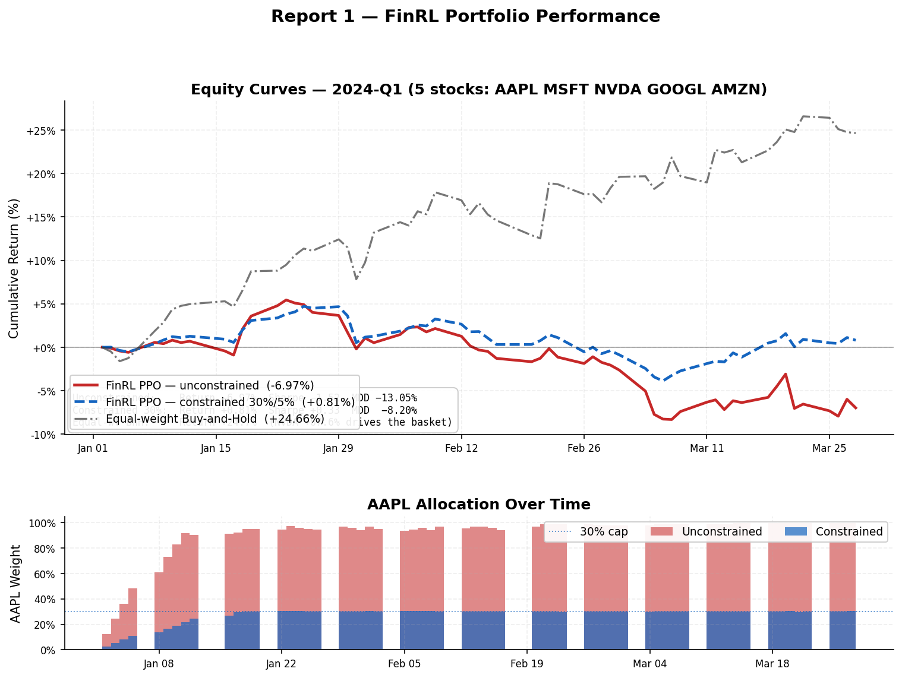
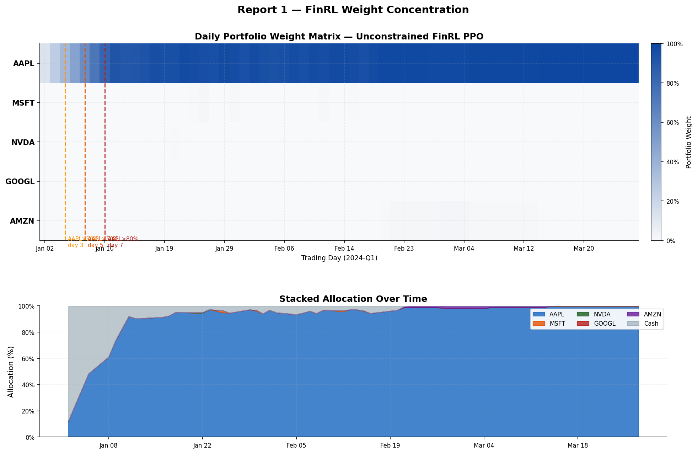

# Report 1 — FinRL Portfolio Performance

**Framework:** AI4Finance-Foundation/FinRL (PPO, stable-baselines3)
**Task:** portfolio_2024q1 · **Tickers:** AAPL, MSFT, NVDA, GOOGL, AMZN
**Train:** 2020-01-01 → 2022-12-31 · **Test:** 2024-01-01 → 2024-03-31 (60 trading days)
**Timesteps:** 50,000 · **Wall-clock:** 139.1 s · **API cost:** $0.00 (local GPU)

---

## Fig 1 — Equity Curves: Unconstrained vs Constrained vs Buy-and-Hold

The upper panel shows three portfolios over the same 2024-Q1 test period. The unconstrained
PPO (red) loses −6.97 % because it locks nearly all capital into AAPL, which fell −7.5 %
in this quarter. Adding a simple 30 % per-stock cap with 5 % minimum cash (blue dashed)
flips the return to +0.81 % and cuts max drawdown from −13.05 % to −8.20 % — **no change
to the model architecture or training procedure was required**. The equal-weight
buy-and-hold baseline (grey dash-dot) returns +24.7 %, driven largely by NVDA (+87.6 %).

The lower bar chart overlays AAPL allocation for both variants day by day. The unconstrained
agent ramps AAPL to >90 % by day 7 and holds it there for the rest of the quarter; the
constrained agent is capped at 30 % and redistributes to the other four stocks.

| | Unconstrained | Constrained 30 % | Equal-wt BnH |
|---|---|---|---|
| Total Return | **−6.97 %** | **+0.81 %** | **+24.7 %** |
| Sharpe (ann.) | −1.524 | +0.330 | — |
| Max Drawdown | −13.05 % | −8.20 % | — |
| Calmar | −2.007 | — | — |

---

## Fig 2 — Daily Weight Matrix & Stacked Allocation

The upper heatmap encodes daily portfolio weight as colour intensity (white = 0 %, dark blue
= 100 %). Three dashed vertical lines mark when AAPL allocation first exceeded 30 % (day 3),
50 % (day 5), and 80 % (day 7). After that, the four remaining stocks (MSFT, NVDA, GOOGL,
AMZN) are effectively invisible — their rows stay white for the rest of the quarter.

The stacked area chart below breaks down the same data by ticker. AAPL (blue) expands to
fill almost the entire stack within the first two weeks; cash (grey) is the only other
visible component.

**Key observation:** PPO learned that AAPL outperformed in 2020–2022 (its training window)
and carried that prior directly into the 2024-Q1 test — a textbook distribution-shift
failure. The policy is not broken; the scenario design is. The constrained variant uses
the same weights after training and distributes capital successfully.
